# XVON

  

---

## About Me

| :star: :star: :star: | :star: :star: :star: :star: :star: |
|---|---|
| **Role** | AI Platform Architect & LLMOps Expert |
| **Focus** | Building self-healing, high-availability AI infrastructure that bridges Enterprise Data and Generative AI |
| **Style** | One-Man Army engineering: from Protocol Reverse Engineering to Frontend Visualization |

  
  

---

## Quote

  

---

## Skills

### Languages

### Stack

---

  

